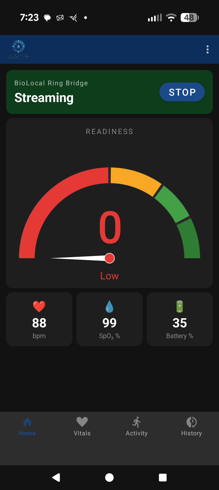
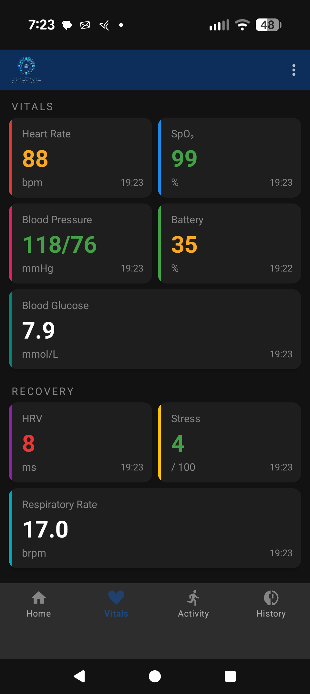
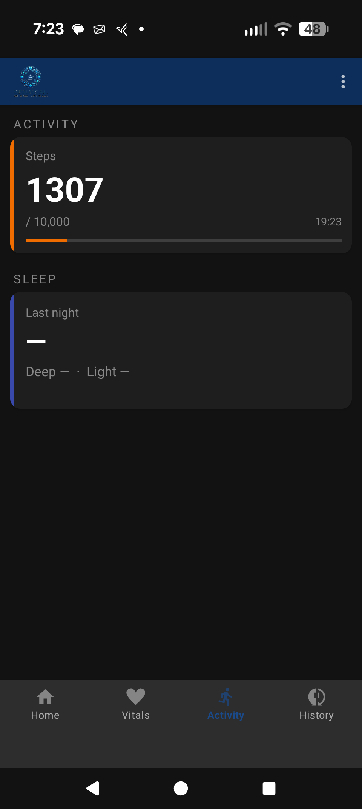
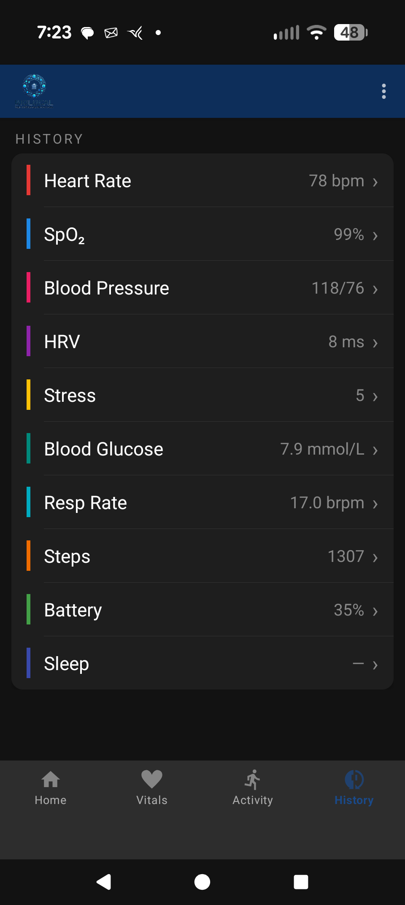
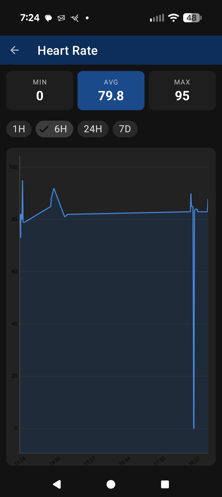
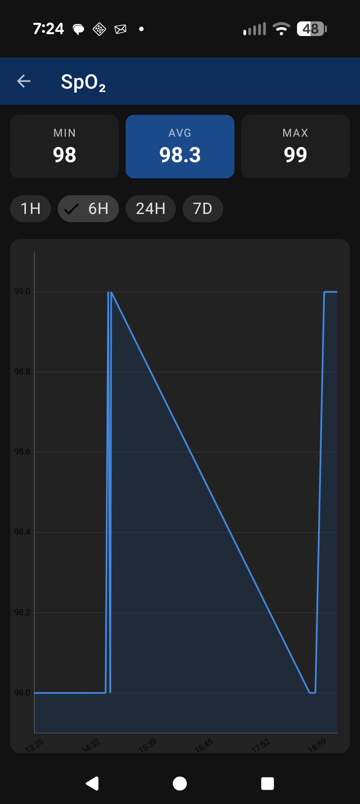

# BioLocal Ring Bridge

> **Fully local health data collection for the LivUp R01L smart ring — no cloud, no subscription, no LivUp app required after initial pairing.**

BioLocal Ring Bridge reverse-engineers the YCBT BLE protocol used by the LivUp R01L (model C923) to stream all sensor data directly to your own infrastructure. Data stays on your hardware and flows into InfluxDB / Grafana / Home Assistant.

---

## Screenshots

<table>
  <tr>
    <td align="center"><b>Home</b></td>
    <td align="center"><b>Vitals</b></td>
    <td align="center"><b>Activity</b></td>
  </tr>
  <tr>
    <td></td>
    <td></td>
    <td></td>
  </tr>
  <tr>
    <td align="center"><b>History</b></td>
    <td align="center"><b>Heart Rate Chart</b></td>
    <td align="center"><b>SpO₂ Chart</b></td>
  </tr>
  <tr>
    <td></td>
    <td></td>
    <td></td>
  </tr>
</table>

---

## What It Captures

History columns reflect what the **R01L (fw 1.13) actually returns**, verified by live
capture on 2026-06-08 — not just what the protocol theoretically supports.

| Metric | Real-time | History | Notes |
|---|:---:|:---:|---|
| Heart Rate | ✅ | ✅ | `0x060A`, `0x0601`; history `0x0506` + `0x0509` |
| Blood Pressure (sys/dia) | ✅ | ✅ | `0x0603`, `0x060A`; history `0x0508` + `0x0509` |
| SpO₂ | ✅ | ✅ | `0x060A`, `0x0602`; history `0x0509[9]` |
| Blood Glucose | ✅ | ✅ | `0x060A[20]` — mmol/L; history `0x0509[17]` |
| HRV / Stress | ✅ | ✅ | Real-time ECG `0x0610`; history `0x0533` body records |
| Respiratory Rate | ✅ | ✅ | `0x060A[11]`; history `0x0509[10]` |
| Steps / Calories / Distance | ✅ | ✅ | `0x060A`, Sport history `0x0511` |
| Sleep Stages | — | ❌ | **Not available on this ring** — `0x0504` returns empty; staging location unknown |
| Battery | ✅ | — | Handshake `0x0200` |
| Wearing State | ✅ | — | `0x060A[14]`, `0x0613` |

---

## Project Structure

```
├── RingBridge/                   Android app (Kotlin, Nordic BLE Library)
│   └── app/src/main/java/dev/ringbridge/
│       ├── RingBleManager.kt     BLE transport — GATT, subscriptions, write queue
│       ├── RingProtocol.kt       Protocol: packet framing, CRC, all decoders
│       ├── RingService.kt        Foreground service: handshake, history, streaming
│       ├── ServerPublisher.kt    Queued HTTP sync to RingBridgeServer
│       ├── db/RingDatabase.kt    Room DB: SensorReading + SleepSession + SleepStage
│       ├── HomeFragment.kt       Status + Readiness gauge
│       ├── VitalsFragment.kt     All health metric cards
│       ├── ActivityFragment.kt   Steps + Sleep
│       └── HistoryFragment.kt    Metric drill-down list
│   └── app/src/test/java/dev/ringbridge/
│       └── RingProtocolTest.kt   JVM unit tests for the protocol decoders
│
├── RingBridgeServer/             Python/FastAPI server (Docker)
│   ├── app/main.py               App entry point, settings seeding, security warning
│   ├── app/routers/api.py        /api/v1 device, readings, and sleep endpoints
│   ├── app/routers/admin.py      Admin dashboard, device QR codes, settings UI
│   ├── app/security.py           bcrypt password hashing (legacy-plaintext aware)
│   ├── app/database.py           SQLite engine + existing-DB dedup-index migration
│   ├── app/forwarder.py          InfluxDB line-protocol + MQTT/HA-discovery writer
│   ├── tests/                    pytest suite (security, api, migration)
│   ├── docker-compose.yml
│   └── Dockerfile
│
├── best-script.py                Python/Bleak test script — BLE terminal dashboard
├── Ring_Protocol_Documentation.md  Byte-level protocol reference (R01L, fw 1.13)
├── YCBT_Protocol_Reference.md    SDK-level reference (from APK reverse engineering)
└── research/                     Decompiled APK sources, BLE captures (gitignored)
```

---

## Android App

### Requirements
- Android 8.0+ (API 26)
- Bluetooth LE
- LivUp app paired to the ring at least once (establishes RCSP auth — no ongoing dependency)

### Build & Install

```bash
cd RingBridge
./gradlew assembleDebug
adb install app/build/outputs/apk/debug/app-debug.apk
```

> **Note:** The Gradle wrapper requires Java 17. If your system default is older, prefix with `JAVA_HOME=/path/to/java17`.

### First Run

1. Tap **Start** on the Home tab
2. Grant Bluetooth permissions when prompted
3. Grant battery optimization exemption (keeps the service alive in the background)
4. The app scans, connects, performs the handshake, pulls ring history, then begins streaming

### App Tabs

| Tab | Contents |
|---|---|
| **Home** | Connection status · Readiness score gauge · HR / SpO₂ / Battery at-a-glance |
| **Vitals** | Heart Rate · SpO₂ · Blood Pressure · Battery · Blood Glucose · HRV · Stress · Resp Rate |
| **Activity** | Steps with goal progress bar · Last night's sleep breakdown |
| **History** | Tap any metric to open its time-series chart (1H / 6H / 24H / 7D) |

### Architecture

```
Ring (BLE INDICATE/NOTIFY)
        │
   RingBleManager          ← GATT transport, write queue
        │
   RingProtocol            ← Packet framing [type_hi][type_lo][len][payload...][crc16]
        │
   RingService             ← Foreground service: handshake → history → streaming loop
        │
   ┌────┴────┐
   │         │
Room DB   ServerPublisher  ← Queues all readings; flushes on interval or Wi-Fi restore
(SQLite)      │
              │  HTTP POST /api/v1/readings
         RingBridgeServer
              │
           InfluxDB ──→ Grafana
           Home Assistant
```

---

## Server (RingBridgeServer)

A lightweight Python/FastAPI service that accepts readings from the Android app and writes them to InfluxDB.

### Quick Start

```bash
cd RingBridgeServer
cp .env.example .env          # set ADMIN_PASSWORD, REGISTRATION_KEY, SESSION_SECRET
docker-compose up -d
```

The server listens on port `8080` by default. On startup it logs a prominent
warning if `ADMIN_PASSWORD`, `REGISTRATION_KEY`, or `SESSION_SECRET` are still at
their insecure defaults — set them before exposing the server beyond your LAN.

### Environment Variables

These seed the settings store on first run; afterwards the values stored in the
database take precedence (edit them from the admin panel).

| Variable | Description |
|---|---|
| `ADMIN_PASSWORD` | Dashboard admin password. Stored bcrypt-hashed; change from `changeme`. |
| `REGISTRATION_KEY` | Key the app must present to register a device token. Change from `changeme`. |
| `SESSION_SECRET` | Secret signing the admin session cookie. Set to a long random string (`openssl rand -hex 32`). |
| `SERVER_URL` | Base URL the app syncs to (embedded in the pairing QR code). |
| `DATABASE_PATH` | SQLite file path inside the container. Defaults to `/data/ringbridge.db`. |

> **InfluxDB and MQTT are *not* configured via environment variables** — they're
> set from the admin panel's Settings page and stored in the database.

### API

All endpoints are under `/api/v1`. Data endpoints require `Authorization: Bearer <token>`.

| Endpoint | Method | Description |
|---|---|---|
| `/api/v1/devices/register` | POST | Register a device and receive a bearer token (requires the registration key) |
| `/api/v1/readings` | POST | Batch ingest sensor readings (deduplicated on `device_id + timestamp + type`) |
| `/api/v1/readings` | GET | Query stored readings (filters: `type`, `start`, `end`, `limit`) |
| `/api/v1/readings/latest` | GET | Most recent reading of each sensor type |
| `/api/v1/sleep` | POST | Ingest sleep sessions (upserted on `device_id + start_ms`) |
| `/api/v1/sleep` | GET | Query stored sleep sessions (filters: `start`, `end`, `limit`) |

The app authenticates with the bearer token on every request. Unsynced readings
and sleep sessions are queued in the local Room database and retried automatically
when connectivity is restored. Old/synced rows are pruned on a rolling 30-day window.

---

## Python Test Script

For quick BLE testing without the Android app:

```bash
pip install bleak
python best-script.py
```

Close the LivUp app first. The script scans for the ring, performs the full handshake, pulls history, then streams live data to a terminal dashboard. All readings are saved to `ring_data.db` (SQLite).

> **Note:** `best-script.py` is a standalone diagnostic tool. It pulls history via the
> combined `0x0509` / `0x0533` commands, while the Android app currently uses the
> per-category commands (`0x0502` / `0x0506` / `0x0508`). **Live testing (2026-06-08)
> showed both command sets return real data on the R01L** — the `0x0509` AllHistory
> stream is actually richer (5-minute HR/BP/SpO₂/glucose). The dedicated Sleep command
> (`0x0504`) returns empty on this ring. See the protocol doc's History section for the
> full verified picture.

**Requirements:** Python 3.9+, macOS or Linux with Bluetooth LE support.

---

## Testing

**Android (JVM unit tests — no emulator required):**

```bash
cd RingBridge
./gradlew testDebugUnitTest
```

Covers `RingProtocol` end to end: CRC, packet framing, every real-time sensor
decoder, and every history decoder (including the sleep session/stage parser and
its malformed-input guard).

**Server (pytest — run in Docker to match the deployment Python):**

```bash
cd RingBridgeServer
docker build -t ringbridge .
docker run --rm -v "$PWD/tests:/app/tests:ro" ringbridge \
  sh -c "pip install -q pytest && python -m pytest tests/ -v"
```

Covers bcrypt hashing (including legacy-plaintext upgrade), the auth/readings/sleep
endpoints, dedup behaviour, and the existing-database dedup-index migration.

---

## Data Flow

```
LivUp R01L Ring
       │  BLE INDICATE/NOTIFY (YCBT protocol)
       ▼
RingBridge Android App
       │  SQLite (offline buffer, 30-day rolling window)
       │  HTTP POST (batched, Wi-Fi-aware)
       ▼
RingBridgeServer (Docker)
       │
       ├──▶ InfluxDB  ──▶ Grafana dashboards
       └──▶ Home Assistant (webhook / MQTT)
```

---

## Protocol Notes

The ring uses the **YCBT protocol** — a proprietary framing layer over BLE INDICATE/NOTIFY characteristics.

**Packet structure:**
```
[type_hi][type_lo][len_lo][len_hi][payload...][crc16_lo][crc16_hi]
```

**Key findings from reverse engineering:**

- `AppControlReal` (`0x0309`) with `realKey=0x0A` triggers comprehensive streaming (`0x060A`) including glucose and resp rate — `realKey=0x00` (Sport mode) does not
- All history meta packets use `payload[6:8]` for the byte count, not `[4:6]`
- `0x0580` ACK **must** carry `[0x00]` payload — an empty payload causes the ring to retransmit the entire history stream
- `0x060A[11]` is respiration rate, not stress
- `0x0613` (WearingStatus) only fires on state changes, not on connect
- Real-time HRV/stress requires triggering an "emotional measurement" sequence (`EMOTIONAL_START` → `CONTROL_WAVE_START` → wait for `0x0610` → `CONTROL_WAVE_STOP`); HRV/stress *history* is also available via `0x0533` body records
- Blood glucose at `0x060A[20]`, raw byte ÷ 10 = mmol/L
- **Sleep staging does not work on this R01L** — `0x0504` returns empty even after a full night; where (or whether) the firmware exposes sleep stages is unresolved
- **Never send history delete commands** (`0x0540`–`0x0543`) — they wipe the ring's only copy of the data; pulls are read-only

See [`Ring_Protocol_Documentation.md`](Ring_Protocol_Documentation.md) for the complete byte-level protocol reference.

---

## Device

| Field | Value |
|---|---|
| Model | LivUp R01L (C923) |
| Chip | JieLi AC632N |
| Firmware | v1.13 |
| BLE Protocol | YCBT SDK (`com.yucheng.ycbtsdk`) |
| Tested MAC prefix | `07:32:00:09:C9:23` |

---

## What Doesn't Work

- **Temperature** — field exists in the protocol but the ring does not populate it reliably (always returns `0xFC`)
- **VO2max** — body history records contain a VO2max field but all observed values are zero; not supported by this ring in practice

---

## Contributing

Pull requests welcome. If you have a different firmware version or a ring that produces different byte layouts, opening an issue with a BLE packet capture is the fastest path to support.

---

## Disclaimer

This project is the result of independent BLE reverse engineering. It is not affiliated with, endorsed by, or connected to LivUp or Yucheng Technology. Use at your own risk. Health metrics from consumer rings are estimates — do not use for medical decisions.
